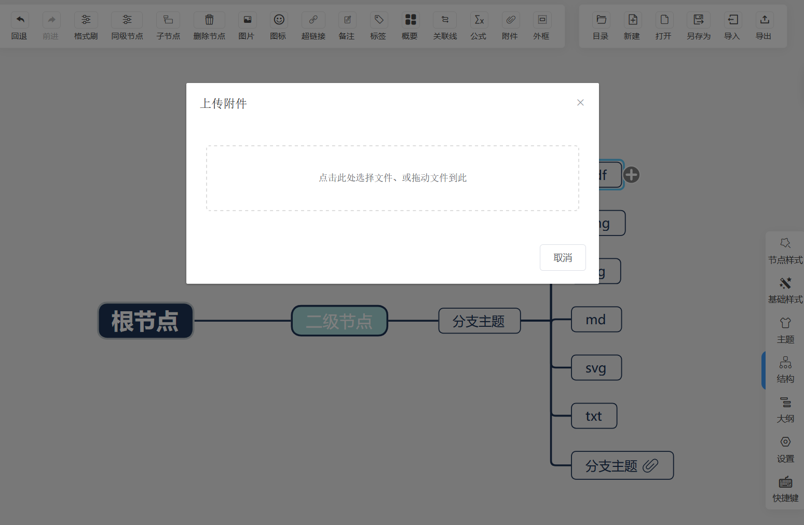
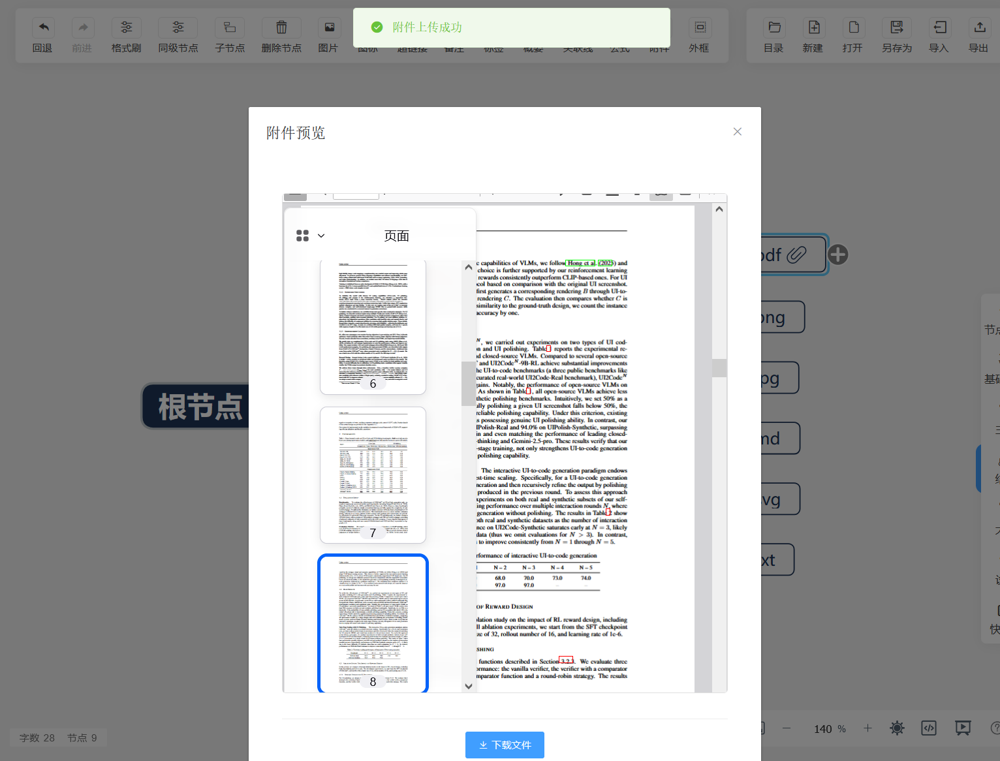

# 思维导图系统 — 实习项目展示

（因实习单位保密协议，本仓库仅展示项目效果与个人工作内容，**不提供任何源代码**）

## 一、项目概述

本项目是我在阿尔卑斯阿尔派（中国）有限公司无锡研发中心实习期间开发的 Web 思维导图应用。
该项目基于开源的 simple-mind-map 项目进行二次开发，主要用于提供思维导图的创建、编辑、导出等功能，满足团队协作与个人知识管理的需求。

在实习期间，我负责为该思维导图系统新增了**节点附件功能**，使用户能够在思维导图的任意节点上附加文件，提升了产品的实用性与用户体验。

## 二、技术栈

- **前端框架**：Vue.js 2.6
- **UI 组件库**：Element UI 2.15
- **后端框架**：Node.js + Express
- **文件上传**：Multer（Node.js 中间件）
- **前端路由**：Vue Router 3.5
- **状态管理**：Vuex 3.6
- **构建工具**：Vue CLI

## 三、我的工作内容

本项目的附件功能由我个人独立完成开发、测试和部署。

1. **负责附件上传模块的前端页面开发**
   - 创建 `FileUpload` 组件，实现拖拽上传与点击选择文件两种方式
   - 使用 FormData API 将文件异步上传至后端服务器
   - 添加上传loading状态与错误处理机制

2. **负责附件与节点的关联实现**
   - 修改思维导图节点的 data 结构，新增 `attachmentUrl` 和 `attachmentName` 字段
   - 通过扩展节点方法 `setAttachment()` 实现附件信息的存取
   - 在节点上渲染附件图标，支持点击查看与删除操作

3. **负责附件预览功能的开发**
   - 实现多种文件类型的在线预览：图片（jpg/png/gif/webp等）、PDF、Markdown、纯文本
   - 使用 `marked` 库实现 Markdown 文件的渲染显示
   - 对于不支持预览的文件类型，提供直接下载功能

4. **负责后端文件管理接口开发**
   - 使用 Multer 中间件处理文件上传，配置唯一文件名避免冲突
   - 实现文件存储、获取、删除三个 RESTful 接口
   - 配置 MIME 类型映射，确保不同文件类型的正确加载
   - 为防止内网环境下文件下载失败的问题，将附件下载方式从 HTTP 请求改为直接从后端服务器获取文件

5. **参与兼容性测试与问题修复**
   - 修复删除节点时服务器文件未同步删除的问题
   - 优化大文件的加载体验

## 四、项目效果展示

### 4.1 页面截图

为节点添加附件：



部分文件类型附件的预览和下载：



### 4.2 功能演示


### 4.3 流程说明

```plain
用户选择文件 → [FileUpload组件] → FormData封装 → [后端API /api/file/upload]
                                                              ↓
                                              [Multer中间件] → 文件存储到uploads目录
                                                              ↓
                                              返回文件URL → [NodeAttachment组件]
                                                              ↓
                                              节点存储attachmentUrl/attachmentName
                                                              ↓
                                              点击附件图标 → [预览/下载]
                                                              ↓
                                              综合判定 → 图片/PDF/Markdown/文本/其他
```

## 五、项目亮点与个人收获

1. **实现了思维导图节点附件功能**，用户可以在任意节点上附加文件，实现了内容与资源的统一管理
2. **实现了多格式文件的在线预览**，无需下载即可查看图片、PDF、Markdown等常见文件类型
3. **熟悉了前后端分离的开发模式**，掌握了 Vue.js 组件化开发与 Express RESTful 接口设计
4. **熟悉了企业级项目开发流程**，包括需求分析、代码实现、测试验证的完整流程
5. **提升了问题排查与解决能力**，在开发过程中遇到跨域、内网下载出错、文件路径、预览渲染等问题并逐一解决

## 六、目录结构

```plain
mind-map-main/
├── web/                         # 前端项目
│   ├── src/
│   │   ├── components/
│   │   │   └── FileUpload/      # 文件上传组件（新增）
│   │   │       └── index.vue
│   │   ├── pages/
│   │   │   └── Edit/
│   │   │       ├── components/
│   │   │       │   ├── NodeAttachment.vue      # 附件对话框组件（新增）
│   │   │       │   ├── AttachmentPreview.vue   # 附件预览组件（新增）
│   │   │       │   ├── ToolbarNodeBtnList.vue  # 工具栏按钮列表（修改）
│   │   │       │   └── Contextmenu.vue         # 右键菜单（修改）
│   │   │       └── Index.vue                    # 编辑页面（修改）
│   │   └── lang/                  # 国际化文件（修改）
│   │       ├── zh_cn.js
│   │       └── en_us.js
│   └── package.json
├── server/                       # 后端项目
│   ├── index.js                  # Express 服务器（新增文件上传接口）
│   └── uploads/                  # 上传文件存储目录
├── 附件功能使用说明.md            # 功能使用文档（新增）
└── README.md
```

## 七、版权说明

- 本项目基于 MIT 协议的开源项目 simple-mind-map 进行二次开发
- 原始项目代码版权归原项目作者所有
- 附件功能为本人实习期间独立开发，仅供学习与展示使用
